# Deploy Python app on GKE

## Tools used

- ### Docker
- ### Terraform
- ### Google Cloud Platform
- ### Kubernetes

## Create and Push Docker Image

### clone app repository
>$ git clone https:github.com/atefhares/DevOps-Challenge-Demo-Code

### create dockerfile
>$ vim Dockerfile
```
FROM python:3.9.10

RUN apt update 

WORKDIR /app
COPY requirements.txt requirements.txt
RUN pip3 install -r requirements.txt
COPY . .
ENTRYPOINT python hello.py

```
<br>

### build image form dockerfile
>$ docker build -t python-app:latest .
<br>

### run redis server
>$ docker run --name redis-db -d -p 6379:6379 redis redis-server --save 60 1 --loglevel warning

<br>

### test docker image
>$ docker run --env-file .env -p 8000:8000 --name python-app python-app

<br>

### create a repository on google artifact registry
>$ gcloud services enable artifactregistry.googleapis.com

>$ gcloud artifacts repositories create gcp-gke-apps --repository-format=Docker --location=us-central1


<br>

### change tags to match the artifact repository 
>$ docker tag python-app:latest us-central1-docker.pkg.dev/ancient-jigsaw-366112/gcp-gke-apps/python-app:latest

>$ docker tag redis-db us-central1-docker.pkg.dev/ancient-jigsaw-366112/gcp-gke-apps/my-redis-db

<br>

### push images to artifact repository

>$ docker push us-central1-docker.pkg.dev/ancient-jigsaw-366112/gcp-gke-apps/python-app:latest

>$ docker push us-central1-docker.pkg.dev/ancient-jigsaw-366112/gcp-gke-apps/my-redis-db


<br>
<br>

## Now for the Terraform part

### enable storage buckets API
for terraform to use your credientials for API calls
>$ gcloud auth application-default login

enable storage API
>$ gcloud services enable storage.googleapis.com

### Create storge bucket for terraform backend

./state-storge-bucket/main.tf

```
provider "google" {
  project = "ancient-jigsaw-366112"
  region     = "us-central1"
}

resource "random_id" "bucket_prefix" {
  byte_length = 8
}

resource "google_storage_bucket" "state-storge-bucket" {
  name          = "${random_id.bucket_prefix.hex}-bucket-tfstate"
  force_destroy = false
  location      = "US"
  storage_class = "STANDARD"
  versioning {
    enabled = true
  }
}
```

>$ terraform init

>$ terraform apply


### Create terraform project
make new directory for the terraform project


[./terraform](terraform)

to store the terraform state file in our backend storge bucket

[./terraform/backend.tf](terraform/backend.tf)

```
terraform {
 backend "gcs" {
   bucket  = "ca722bb262a23d93-bucket-tfstate" # storge bucket id
   prefix  = "terraform/state"
 }
}
```

>$ terraform init

### copy files in [./terraform](terraform)

>$ terraform apply --var-file prod.tfvars

### results:
- vpc
- subnets
  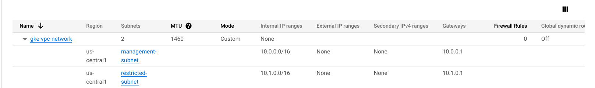
- router
  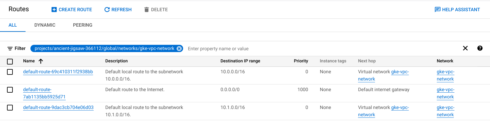
- nat-gateway
  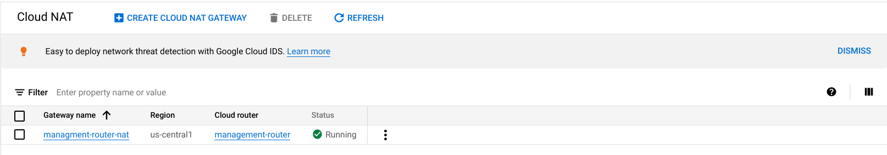
- instance
  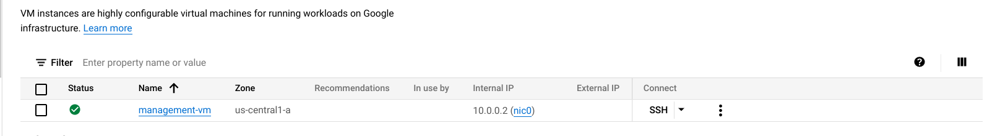
- firewall
  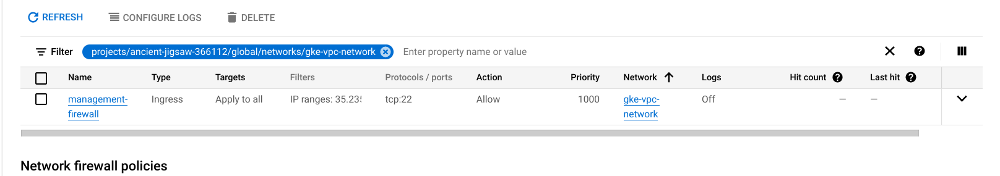
- google_container_cluster
  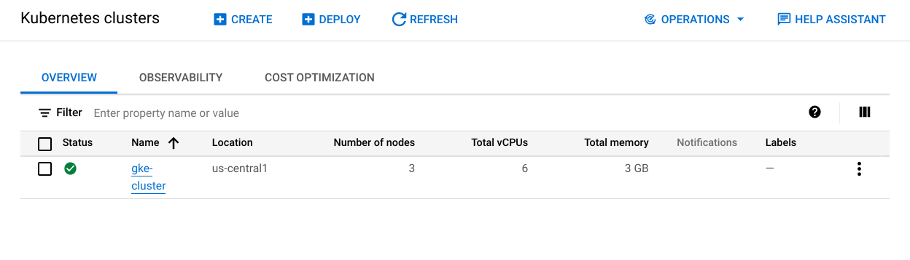
- container_node_pool
  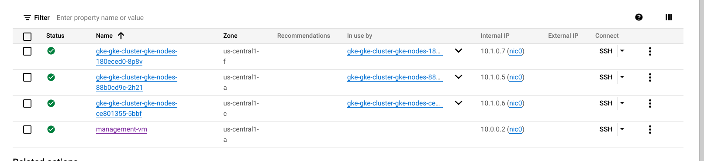

## Connect to cluster

### ssh to private VM

>$ gcloud compute ssh --zone "us-central1-a" "management-vm"  --tunnel-through-iap --project "ancient-jigsaw-366112"

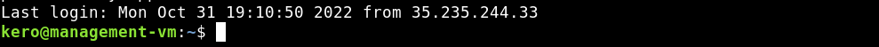

### login
>$ gcloud auth login
### connect to cluster
Install the gke-gcloud-auth-plugin
>$ sudo apt-get install google-cloud-sdk-gke-gcloud-auth-plugin

Now connect kubectl to the cluster

>$ gcloud container clusters get-credentials gke-cluster --region us-central1 --project ancient-jigsaw-366112

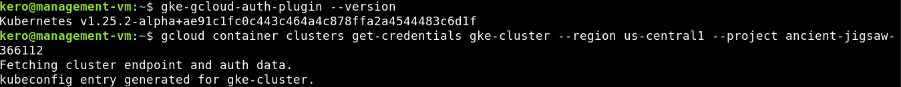

### install kubctl
>$ apt-get update

>$ apt-get install -y kubectl

>$ kubectl version --short --client

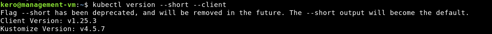

Test kubectl

>$ kubectl get nodes

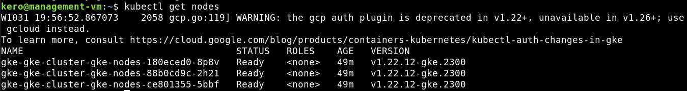

